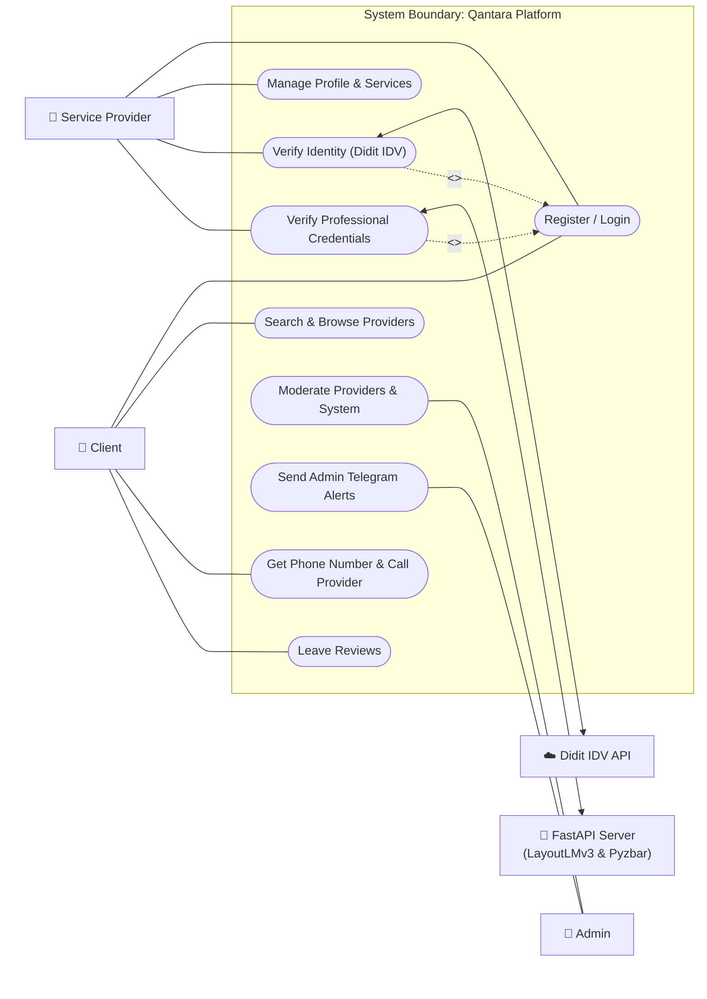
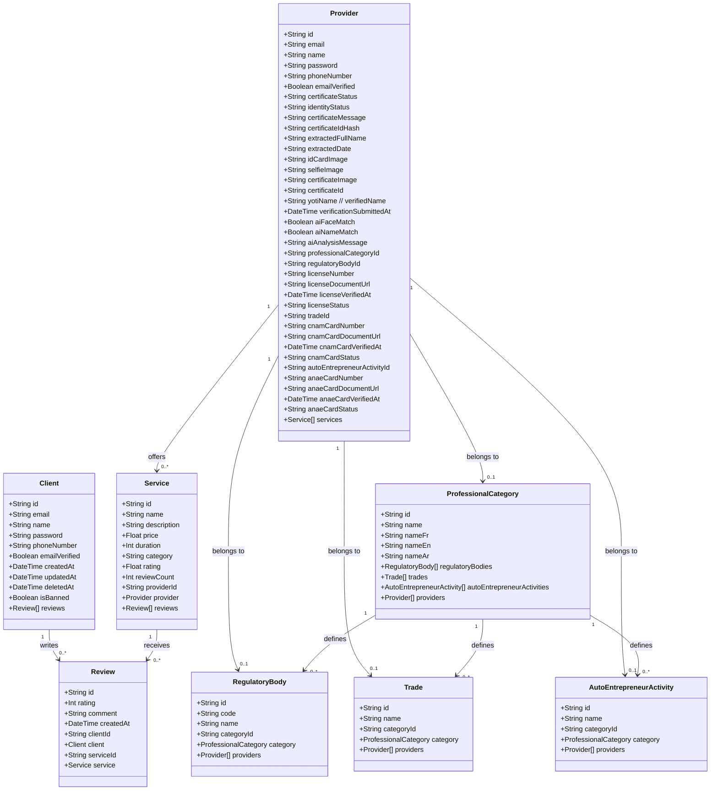
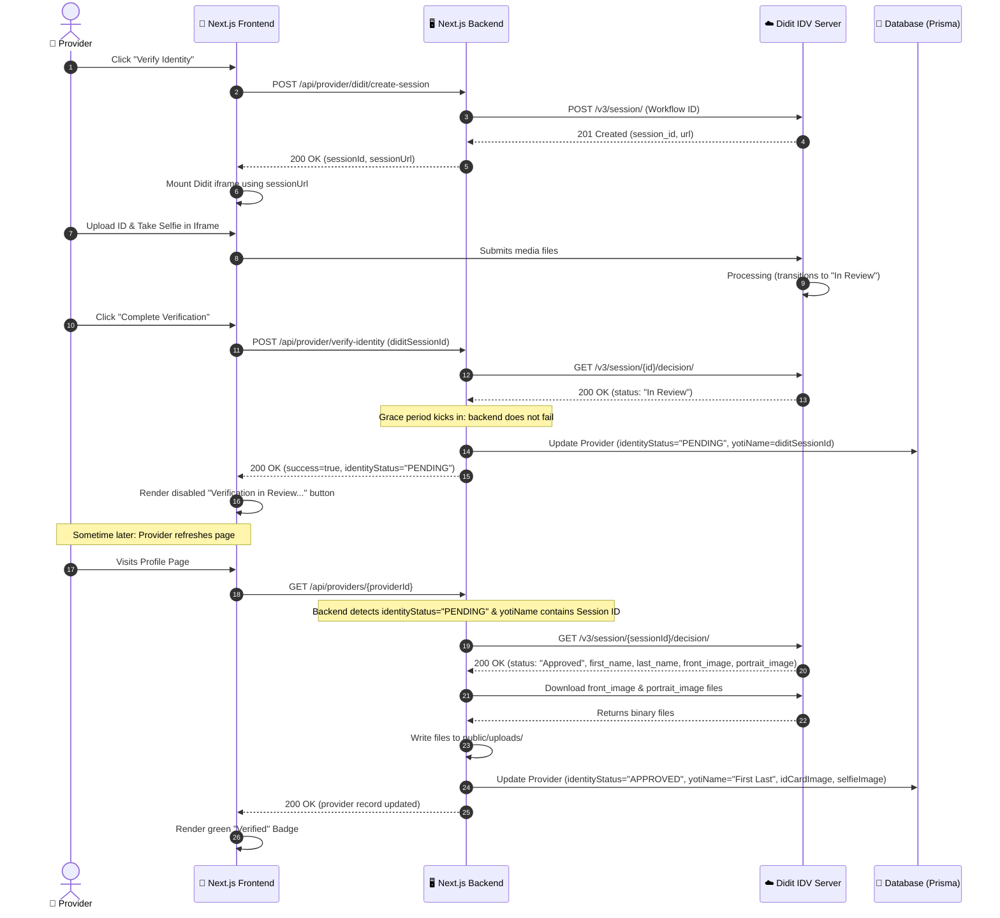
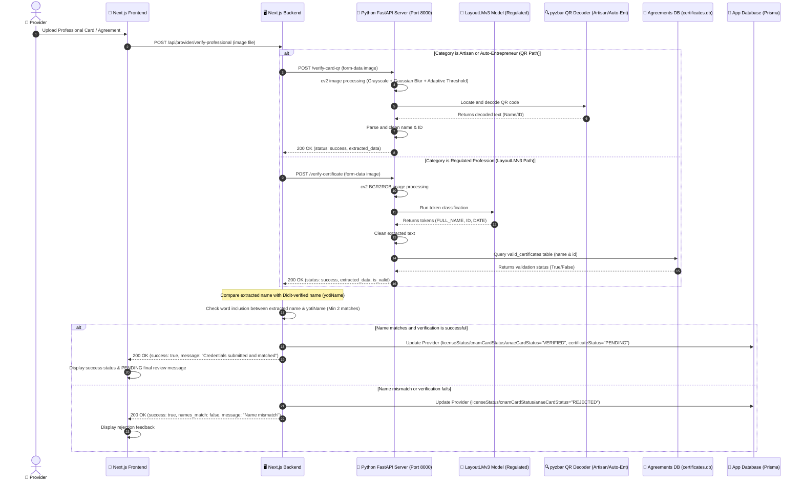

# Qantara Architecture & UML Diagrams

This document contains the core UML diagrams mapping the design, database relationships, and key verification workflows of the Qantara platform.

---

## 1. Use Case Diagram

The use case diagram illustrates the actors (Provider, Client, Admin, and external APIs) and their interactions with the system boundary.

---

## 2. Class Diagram (Database Schema)

This class diagram represents the Prisma schema models, fields, types, and database relationships (SQLite/PostgreSQL).

---

## 3. Sequence Diagrams

### A. Identity Verification Flow (Didit Integration with In-Review Grace Period)

This sequence maps the flow from the moment the provider triggers the Didit verification to when the background lazy check auto-completes verification.

---

### B. Professional Agreement / Card Verification Flow (FastAPI + LayoutLMv3 / Pyzbar)

This sequence maps how professional credentials are AI-verified (using local model or QR code decoding) and cross-matched against the Didit-verified name.

